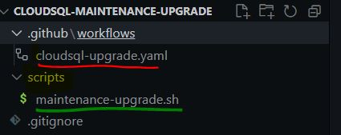

# CLOUDSQL MAINTENANCE UPGRADE

This repo is designed to perform Cloud SQL Postgres Maintenance Upgrades when they are made available by GCP.

### Workflow :

1. The Github Action will run every day at 12:15 PM IST , it is being run on a self hosted runner .
2. It there is a version change detected from the present Maintenance Version , it will send a Notification on slack channel.
3. Then it will place a 90 days Exclusion Window on the Postgres Instance and will also notify on slack the Window start and End timings being set.
4. Then it will patch the Postgres Instance with the New Maintenance version and once the Instance is Patched it will notify again on Slack that the Instance is Patched with Latest Maintenance Version .

### Structure :

### GCP Authentication

The Authentication to GCP is being done using a action called 'auth' provided by google github actions , refernce : https://github.com/google-github-actions , at this point a Service account JSON key is used for getting authenticated with Google Cloud and the Service Account is stored as Github repo secret .

NOTE: Follow this trobubleshooting guide if using Github secret to store Service Account JSON key as the key needs to remove all the spaces and should be in single line : https://github.com/google-github-actions/auth/blob/main/docs/TROUBLESHOOTING.md#aggressive--replacement-in-logs

